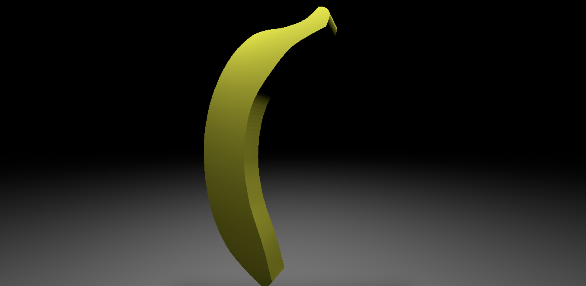

# three-svg-extrude

An npm package that effortlessly transforms SVG shapes into extruded 3D geometries for use in ThreeJS scenes.

Feel free to clone and use the [demo](https://github.com/jakeMartin1234/three-svg-extrude-test)



## Prerequisites

1. Have [threeJS](https://threejs.org/) installed in your project.
2. Have a threeJS scene set up that is runnable on the browser.

## Installation

```bash
npm install three-svg-extrude
``` 

## Code Snippets

Import the Library into your file.

```javascript
import { svgToExtrudedGeometry } from 'three-svg-extrude';
```

The following code is from the [demo](https://github.com/jakeMartin1234/three-svg-extrude-test) and is an example of the intended method of use.

The first argument is the file path to the svg file you want to extrude.
The second argument is the depth of extrusion, and you can use the third (scale) variable to adjust the size
of the geometry.

```javascript
async function loadAndExtrudeSVG() {
    try {
        const scale = 0.01;
        const extrudeDepth = 1
        const geometry = await svgToExtrudedGeometry('bananaSVG.svg', extrudeDepth, scale);

        const material = new THREE.MeshPhongMaterial({ color: 'yellow' });
        const mesh = new THREE.Mesh(geometry, material);
        mesh.rotation.z += Math.PI / 2
        mesh.position.y -= 6;
        mesh.position.x += 3

        scene.add(mesh);
        animate();
    } catch (error) {
        console.error("Error extruding SVG:", error);
    }
}
```
